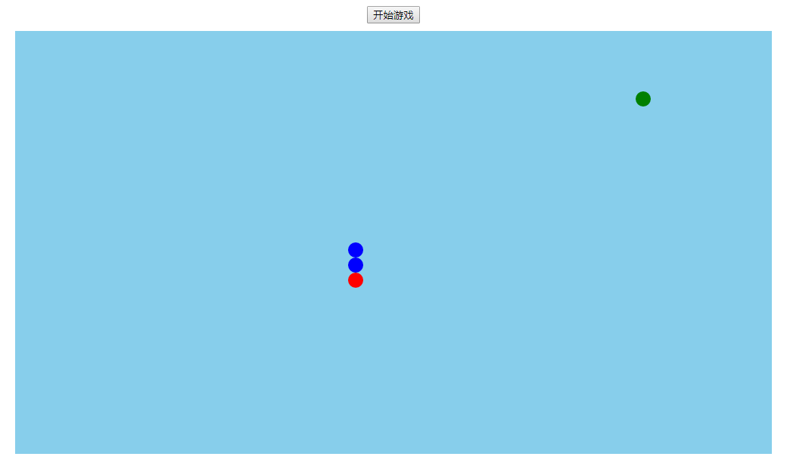

## 纯JavaScript实现的网页版贪吃蛇

写这个小例子时在学习构造函数创建对象，所以元素都是以构造函数形式动态创建的。

#### 一、思路

1.让我们的小蛇动起来

2.随机生成食物

3.每吃掉一个食物，蛇的身体会变长，食物会重新换位置

##### 蛇对象

```
属性：方向、一组蛇节（div，div，div）、地图、食物
方法：生成蛇，增加蛇头，计算新蛇头的位置，蛇移动
```

##### 食物对象

```
属性：横向位置、纵向位置、div元素、地图
方法：随机位置
```

##### 游戏对象

```
属性：蛇，食物 
方法：开始
```

#### 二、目录

Game.js主要写我们游戏的主逻辑代码,这里我们写了游戏控制器对象的构造函数,同时创建Food,Snake,并传入Map,因为这三者就是我们游戏的三大要素,游戏逻辑都围绕这三者展开,写好我们的start方法,调用此方法就开始我们的游戏,还有一些别的方法,都跟另外两个js文件有关系,在这不赘述,仅对一些比较重要的部分做一些说明.

Food.js主要是对Food对象的创建,还有对应的方法的撰写,主要用到Food的render渲染方法,因为每一次吃掉食物或者是初始化的时候都要调用这个函数产生新的食物,产生新食物还要调用remove方法删去之前的旧食物.

Snake.js创建蛇对象,这里渲染函数还有删除函数就不赘述了,move函数是游戏逻辑的重要部分,我们控制我们的蛇移动,除了蛇头部分,可以把蛇的身体分成一节一节的,那么观察很容易得知,蛇每移动一步,后一节的部分,总会等于上一节的位置,所以我们用一个循环就可以解决了,剩下蛇头的部分,我们可以通过switch方法来控制,这里面还有一个重要的逻辑就是,贪吃蛇玩法的特点之一,就是蛇吃了食物之后会变成蛇身体的一部分(也就是蛇身变长),所以,move方法需要做一个检测,也就是当蛇头的坐标等于食物的坐标时,即判定为吃到食物,此时,蛇身就会变长,观察得知,吃了食物后,蛇多出来的那一节,就是蛇最后一节身体的部分.

#### 三、效果

